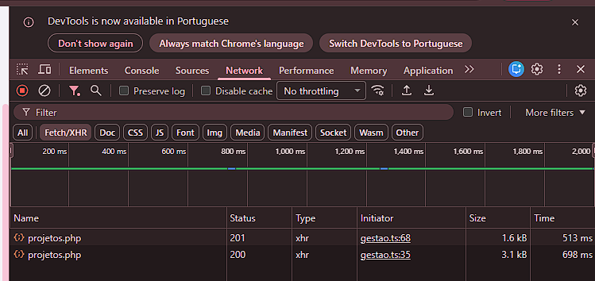
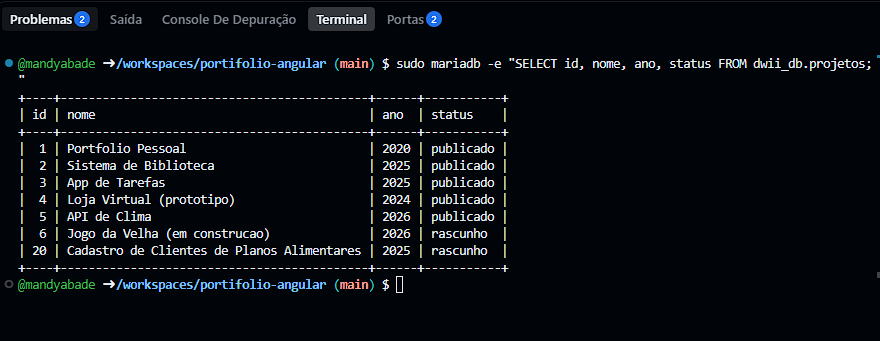

# Meu Portfólio Angular
Projeto desenvolvido para praticar Angular e criar um portfólio pessoal.

## Tecnologias
- Angular
- HTML
- CSS

## Ambiente
Node.js: v20.x.x
npm: v10.x.x
Angular CLI: v19.x.x

## Como executar
Para melhor organização, vamos abrir 3 terminais:
-1º: iniciamos o banco de dados;
      sudo service mariadb start
-2º: iniciamos o navegador com a porta;
      /usr/bin/php -S localhost:8000 --> com a porta 8000 visível
-3º: iniciamos o Portifólio Angular;
      ng serve

## Aula 16 - 08/06/2026
# Funcionalidades adicionadas
- Barra de navegação
- Página Home
- Página Sobre

Acesse http://localhost:4200

## Aula 17 - 15/06/2026
# Funcionalidades adicionadas
- Conexão com o banco de dados MariaDB
- Criação de API's

## Como executar
- Acesse /usr/bin/php -S localhost:8000
- Adicione na URL api/nome_do_arquivo
- Para a página detalhes: após o adicional da URL, adicione o id, desse modo: api/detalhes.php?id=n°

## Aula 18 - 10/08/2026
# Funcionalidades adicionadas
- Criação da página contatos, com formulário 

## 🎯 Autoavaliação

**Conceito pretendido: A**

### Justificativa

- **Form reativo + erro por campo:**  
  Em `src/app/contato/contato.ts`, linhas 15 e 22–26, o formulário é criado com `FormBuilder` e utiliza `Validators.required`, `Validators.email` e `Validators.minLength`.  
  Em `src/app/contato/contato.html`, linhas 7–9, 13–15 e 19–21, são exibidas mensagens específicas de erro somente quando o campo está inválido e foi tocado (`invalid && touched`).  
  Em `src/app/contato/contato.ts`, linhas 32–40, o formulário é marcado como tocado e o foco é direcionado ao primeiro campo inválido.

- **POST via service + tratamento:**  
  Em `src/app/contato.service.ts`, linhas 12–18, o `HttpClient` realiza o envio dos dados através de `http.post()`.  
  Em `src/app/contato/contato.ts`, linhas 45–49, a resposta de sucesso é tratada pelo callback `next`, enquanto nas linhas 50-60 o callback `error` trata as falhas da requisição.

- **Endpoint PHP (`php://input`, validação, prepared, 201/400):**  
  Em `api/contato.php`, linha 15, os dados são recebidos através de `php://input`.  
  Nas linhas 17–19, os campos recebidos são tratados.  
  Nas linhas 21–25, são realizadas as validações de nome, e-mail e mensagem.  
  Nas linhas 27–31, quando existem erros de validação, o endpoint retorna HTTP **400** e envia o array `erros`.  
  Nas linhas 34–37, é utilizada uma consulta preparada com PDO através de `prepare()` e `execute()` para inserir os dados no banco.  
  Nas linhas 39–44, após o cadastro realizado com sucesso, o endpoint retorna HTTP **201** e uma mensagem de confirmação.

- **Estados, robustez e UX (DUA):**  
  Em `src/app/contato/contato.ts`, linhas 18–20, são definidos os estados `enviando`, `sucesso` e `erro`.  
  Na linha 42, o estado `enviando` é ativado durante o envio.  
  Em `src/app/contato/contato.html`, linhas 23–25, o botão apresenta o texto `Enviando...` e fica desabilitado enquanto o formulário estiver inválido ou durante o envio.  
  Em `src/app/contato/contato.ts`, linhas 45–49, após o sucesso o formulário é resetado e o estado de envio é finalizado.  
  Nas linhas 50–60, os erros retornados pelo backend são aproveitados através de `err.error?.erros` e o botão é reabilitado após o erro.  
  Em `src/app/contato/contato.html`, as linhas 4–5, 11–12 e 17–18 utilizam `label` associado aos campos através de `for`/`id`. As linhas 5, 12 e 18 utilizam `aria-invalid` para indicar o estado de validação dos campos. As mensagens de erro também utilizam o símbolo `⚠`, evitando que a cor seja o único sinal de erro.

## Aula 19 
# Parte 1:
## 🧪 Testes da API REST — Prova do Back-end

Antes da integração com o front-end Angular, foram realizados testes diretamente na API para verificar o funcionamento dos métodos HTTP **GET, POST, PUT e DELETE**.
A API utilizada foi:

http://localhost:8000/api/projetos.php

### 1. GET — Listar projetos publicados

**Comando:**
curl -i "http://localhost:8000/api/projetos.php"

**Resposta esperada:**
HTTP/1.1 200 OK
Content-Type: application/json; charset=utf-8
[
  {
    "id": 1,
    "nome": "Projeto de teste",
    "descricao": "Descrição do projeto",
    "tecnologias": "PHP, MySQL",
    "link_github": "",
    "ano": 2026
  }
]
O método GET retorna somente os projetos que possuem `status = 'publicado'`, ordenados pelo ano de forma decrescente.
---
### 2. POST — Criar um projeto

**Comando:**
curl -i -X POST "http://localhost:8000/api/projetos.php" -H "Content-Type: application/json" -d '{"nome":"Projeto de teste","descricao":"Projeto criado pela API","tecnologias":"PHP, MySQL","link_github":"","ano":"2026"}'

**Resposta esperada:**
HTTP/1.1 201 Created
Content-Type: application/json; charset=utf-8
{
  "id": 7
}
O método POST cria um novo projeto no banco de dados. O `id` é gerado automaticamente pelo banco.

> **Observação:** o número do `id` pode ser diferente, dependendo dos registros existentes no banco.
---
### 3. PUT — Atualizar um projeto

**Comando:**
curl -i -X PUT "http://localhost:8000/api/projetos.php?id=7" -H "Content-Type: application/json" -d '{"nome":"Projeto de teste (editado)","ano":"2026"}'

**Resposta esperada:**
HTTP/1.1 200 OK
Content-Type: application/json; charset=utf-8
{
  "mensagem": "Projeto atualizado"
}
O método PUT utiliza o id informado na URL para localizar o projeto e atualizar seus dados.

**Importante:** no código da API, o ID é obtido através de:
$id = isset($_GET['id']) ? (int) $_GET['id'] : 0;
---
### 4. DELETE — Excluir um projeto

**Comando:**
curl -i -X DELETE "http://localhost:8000/api/projetos.php?id=7"

**Resposta esperada:**
HTTP/1.1 204 No Content

O método DELETE utiliza o id informado na URL e remove o projeto do banco de dados.

Caso o projeto não seja encontrado, a API retorna:
HTTP/1.1 404 Not Found
{
  "erro": "Projeto não encontrado"
}
---
### ✅ Resultado dos testes

| Método | Função                     | URL                      | Resultado        |
| ------ | -------------------------- | ------------------------ | ---------------- |
| GET    | Listar projetos publicados | `/api/projetos.php`      | `200 OK`         |
| POST   | Criar projeto              | `/api/projetos.php`      | `201 Created`    |
| PUT    | Atualizar projeto          | `/api/projetos.php?id=7` | `200 OK`         |
| DELETE | Excluir projeto            | `/api/projetos.php?id=7` | `204 No Content` |

## Aula 20

#Status na aba Network:

#Print do terminal com o resultado de sudo mariadb -e "SELECT id, nome, ano, status FROM dwii_db.projetos;:

#Resposta à: "Por que o mesmo endereço api/projetos.php consegue fazer quatro coisas diferentes?"

O mesmo endereço api/projetos.php consegue fazer quatro coisas diferentes porque ele identifica qual método HTTP foi usado na requisição.
Por isso com a mesma URL, cada função faz o que deve ser feito, o GET consulta, o POST cadastra, o PUT altera e o DELETE exclui.

#Se você clicar em Adicionar projeto duas vezes bem rápido, o que acontece?

Se for clicado duas vezes, o segundo envio não deve ser realmente feito, pois o botão fica desabilitado logo depois do primeiro click, enquanto salvando está true.

#Descreva a diferença entre os dois caminhos, depois de salvar, nde excluir:

Depois de salvar faço um novo GET com carregar() para buscar da API a lista atualizada. No excluir removo diretamente o projeto do array local com filter(), evitando outra requisição no servidor.

#Qual delas custa uma viagem à rede a menos, e o que pode ficar desatualizado na tela se o dado mudar por fora?

Por eu fazer um novo GET para buscar os dados atualizados no servidor, e no excluir apenas removo o projeto do array local, o excluir economiza uma viagem à rede, mas pode ficar desatualizado se outra pessoa ou outra tela alterar os dados no servidor enquanto a página está aberta.

#Por que o navegador precisa dessa resposta antes de mandar o DELETE?

O navegador pode enviar uma requisição OPTIONS antes do DELETE para verificar se a API permite esse método e quais regras de acesso CORS estão configuradas. A resposta 204 confirma que a requisição de verificação foi aceita antes do envio do DELETE.

#"Botão com (click) é complicação. Um link <a href=".../projetos.php?id=5">Excluir</a> faz a mesma coisa e é mais simples."

Um botão com click é adequado porque chama o método excluir() do Angular, que envia uma requisição DELETE para a API. Já um <a href> realiza uma requisição GET, portanto não executaria a exclusão quando a API espera o método DELETE.

### Teste com curl
Para comprovar que a API diferencia os métodos HTTP, foi utilizado:

curl -i -X DELETE "https://jubilant-adventure-5g69x95p4gpwcvvgr-8000.app.github.dev/api/projetos.php?id=99999"

Resultado:
HTTP/2 404
{"erro":"Projeto não encontrado"}

Esse teste comprova que a API recebeu uma requisição DELETE e tentou excluir o projeto informado pelo id. Um link <a href> faria uma requisição GET, que possui outra finalidade na API.

Foram também realizados testes com curl para verificar os erros previstos da API.

### 400 — POST sem nome
curl -i -X POST "https://jubilant-adventure-5g69x95p4gpwcvvgr-8000.app.github.dev/api/projetos.php" -H "Content-Type: application/json" -d "{}"

**Resultado:**
HTTP/2 400
{"erro":"Informe pelo menos o nome do projeto"}

### 400 — PUT sem ID
curl -i -X PUT "https://jubilant-adventure-5g69x95p4gpwcvvgr-8000.app.github.dev/api/projetos.php" -H "Content-Type: application/json" -d "{\"nome\":\"Teste\"}"

**Resultado:**
HTTP/2 400

Nesse caso, a API rejeitou a requisição porque o id não foi informado na URL.

### 404 — DELETE com ID inexistente
curl -i -X DELETE "https://jubilant-adventure-5g69x95p4gpwcvvgr-8000.app.github.dev/api/projetos.php?id=99999"

**Resultado:**
HTTP/2 404
{"erro":"Projeto não encontrado"}

### 405 — Método não permitido
curl -i -X PATCH "https://jubilant-adventure-5g69x95p4gpwcvvgr-8000.app.github.dev/api/projetos.php"

**Resultado:**
HTTP/2 405

O método PATCH não é tratado pela API, que trabalha com GET, POST, PUT e DELETE.

### OPTIONS — Verificação de CORS
curl -i -X OPTIONS "https://jubilant-adventure-5g69x95p4gpwcvvgr-8000.app.github.dev/api/projetos.php"

**Resultado:**
HTTP/2 204
access-control-allow-methods: GET, POST, PUT, DELETE, OPTIONS

O navegador pode enviar uma requisição OPTIONS antes de operações como DELETE para verificar se o servidor permite aquele método e se as regras de CORS autorizam a requisição.

## 🎯 Autoavaliação

**Conceito pretendido: A**
### Justificativa

* **R1 (API decide pelo verbo):** api/projetos.php, linhas 28–95.
* **R1 (erros 400/404/405 testados):** README.md, seção **"Testes com curl"**, com os comandos curl e os respectivos resultados.
* **R2 (tela pelo service, sem HttpClient no componente):** src/app/gestao/gestao.ts, linhas 35–40.
* **R2 (campo status no formulário):** src/app/gestao/gestao.html, linhas 38–42.
* **R3 (lista atualiza sem F5):** src/app/gestao/gestao.ts, linhas 35–47, utilizando carregar() após o salvamento.
* **R4 (justificativa das quatro operações):** README.md.
* **R4 (comparação das estratégias de atualização):** README.md
* **R5 (instruções de execução):** README.md, seção **"Como executar"**.

### Critérios adicionais do nível A
* **Erros tratados e visíveis:** as operações de carregar, criar, editar e excluir possuem tratamento de erro no gestao.ts. Quando uma requisição falha, a mensagem é armazenada em erro e exibida na tela pelo gestao.html, em português. Dessa forma, o usuário não depende apenas do console para saber que ocorreu um problema.

* **Polimento de interface:** a lista possui um estado próprio quando não existem projetos cadastrados, exibindo a mensagem **"Nenhum projeto cadastrado."** em vez de deixar a tela vazia. Esse recurso melhora a compreensão do usuário sobre o estado da aplicação.

* **Pré-voo CORS:** foi executado o comando:
curl -i -X OPTIONS "https://jubilant-adventure-5g69x95p4gpwcvvgr-8000.app.github.dev/api/projetos.php"

Resultado:
HTTP/2 204
access-control-allow-methods: GET, POST, PUT, DELETE, OPTIONS

O navegador pode enviar uma requisição OPTIONS antes do DELETE para verificar se o servidor permite aquele método e se a requisição está autorizada pelas regras de CORS.

* **Comparação das estratégias:** depois de salvar, a aplicação faz uma nova requisição GET através de carregar(), garantindo que a lista seja buscada novamente no servidor. No excluir, o projeto é removido diretamente do array local com filter(), economizando uma viagem à rede. A desvantagem é que o array local pode ficar desatualizado caso outra aba, outro usuário ou uma alteração direta no banco modifique os dados.

### 🗣️ Item interativo — `(click)` x `<a href>`

Um botão com (click) chama o método excluir() do Angular, que envia uma requisição DELETE. Um `<a href>` normalmente envia GET, portanto não realiza a mesma operação.

A evidência foi obtida com:
curl -i -X DELETE "https://jubilant-adventure-5g69x95p4gpwcvvgr-8000.app.github.dev/api/projetos.php?id=99999"

Resultado:
HTTP/2 404
{"erro":"Projeto não encontrado"}

Isso comprova que a API trata a exclusão através do método DELETE.
